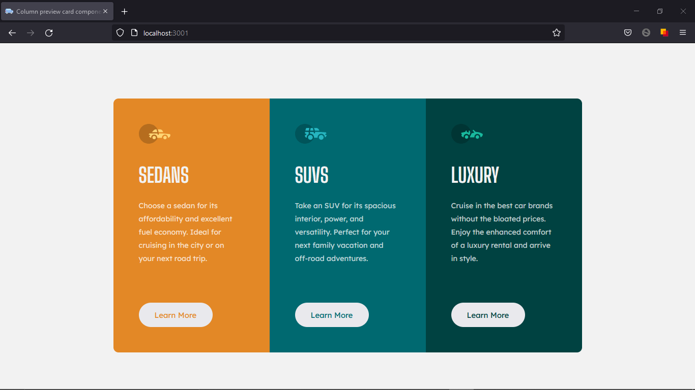
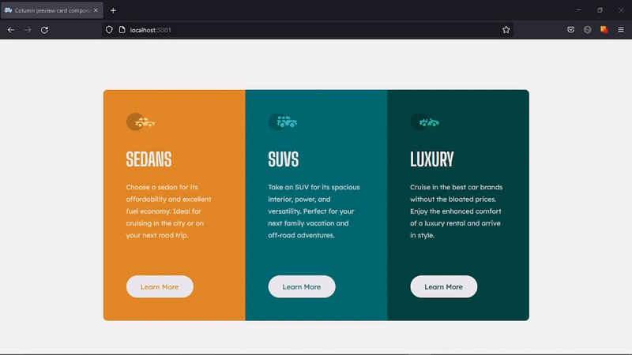

# 3-column preview card component solution

Solucion a [3-column preview card component challenge on Frontend Mentor](https://www.frontendmentor.io/challenges/3column-preview-card-component-pH92eAR2-).

## Tabla de contenido

- [3-column preview card component solution](#3-column-preview-card-component-solution)
  - [Tabla de contenido](#tabla-de-contenido)
  - [Informacion general](#informacion-general)
    - [Desafios](#desafios)
    - [Screenshots](#screenshots)
    - [Links](#links)
    - [Utilice](#utilice)
    - [Que aprendi](#que-aprendi)
    - [Recursos utiles](#recursos-utiles)
  - [Author](#author)


## Informacion general

### Desafios

Los usuarios deben ser capaces de:

- Ver el diseño óptimo según el tamaño de pantalla de su dispositivo
- Ver estados de desplazamiento para elementos interactivos

### Screenshots


 

### Links

- Solucion URL: [https://github.com/NicolasGula/3-Column-Preview-Card-Component](https://github.com/NicolasGula/3-Column-Preview-Card-Component)
- Sitio URL: [https://columnpreviewcardcomponent.netlify.app/](https://columnpreviewcardcomponent.netlify.app/)

### Utilice

- HTML5 
- CSS and SASS
- Flexbox
- Mobile-first workflow
- [React](https://create-react-app.dev/) - JS library

### Que aprendi

- La reutilizacion de componentes para crear interfaces de usuario con [React](https://reactjs.org/) 

```js
export default function App() {

  const cars = carsData.map(info => (<Card key={info.id} {...info} />))

  return (
    <div className="cards-container">
      {cars}
    </div>
  );
}
```
- El pasaje de argumentos entre componentes (props)
```js
export default function Card(props) {

    return (
        
        <div className={'card'+ props.id + " card"}>
            </img>
                <h1>{props.type}</h1>
                <p>{props.description}</p>
                <button>Learn More</button>
        </div>

    )
}
```

### Recursos utiles

- [Learn react for free in SCRIMBA (Ingles)](https://scrimba.com/learn/learnreact) 
- [Curso completo de REACT (español)](https://www.youtube.com/watch?v=VoMyUgI-5NI&list=PLRM7PpbqqStKo-NiCuzuYwewZmd9b-EZ9&ab_channel=JAB%7CJavascriptforever) 

## Author

- Website - [Nicolas](https://www.your-site.com)
